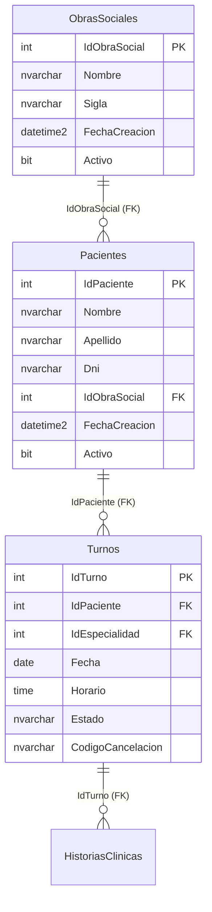
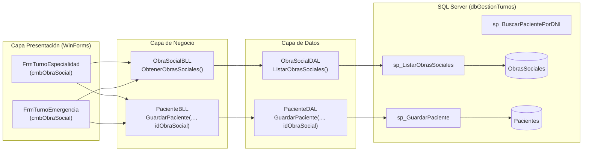

# Plan de Implementación: Entidad ObraSocial y Selección en Formularios de Turnos

## Descripción del Objetivo

El objetivo de este cambio es normalizar y modernizar la gestión de obras sociales en el sistema de gestión de turnos médicos:
1. **Base de Datos Relacional**: Crear la nueva tabla `ObrasSociales` con auditoría completa (`EntidadAuditable`), pre-cargada con las obras sociales de Argentina activas en la provincia de Corrientes (más la opción *"Particular / Sin Obra Social"*).
2. **Reemplazo de Columna en Pacientes**: Suplantar la columna de texto libre `Pacientes.ObraSocial` por una clave foránea `Pacientes.IdObraSocial` vinculada a `ObrasSociales(IdObraSocial)`, migrando de forma segura los datos existentes.
3. **Actualización de Stored Procedures y Consultas**: Adaptar los SPs existentes (`sp_GuardarPaciente`, `sp_BuscarPacientePorDNI`, `sp_ObtenerHorariosConEstado`, `sp_ListarTurnosAtencion`, `sp_ObtenerAtencionesPorMedico`, `sp_ReporteGuardiaTriage_Detalle`) y crear `sp_ListarObrasSociales` para operar con la nueva relación sin romper el display de texto en comprobantes y grillas.
4. **Capas DAL / BLL / Modelo**: Incorporar la entidad `ObraSocial`, su DTO `ObraSocialDTO`, actualizar el `DbContext` (`dbTurnosMedicos`), `PacienteDAL` y `PacienteBLL`, y crear `ObraSocialDAL` y `ObraSocialBLL`.
5. **Experiencia de Usuario (UI)**: Reemplazar los controles `TextBox txtObraSocial` por `ComboBox cmbObraSocial` (modo desplegable no editable) en `FrmTurnoEmergencia` y `FrmTurnoEspecialidad`, permitiendo seleccionar la obra social al registrar un paciente o autoseleccionarla y bloquearla cuando el paciente ya está registrado por DNI.

---

## Revisión Requerida del Usuario

> [!IMPORTANT]
> **Migración de Datos Existentes en `Pacientes`:**
> En la tabla `Pacientes` existen actualmente registros con coberturas en formato texto (ej. `"Sancor Salud"`, `"Osecac"`, `"ISSUNE"`, `"-"`, etc.).
> El script de migración mapeará automáticamente los valores existentes al ID de la obra social correspondiente en el nuevo catálogo; cualquier valor vacío o no coincidente se asignará por defecto a `"Particular / Sin Obra Social"`.

> [!NOTE]
> **Catálogo de Obras Sociales Activas en Corrientes:**
> Se incluirá el catálogo oficial con presencia activa y operativa en la provincia de Corrientes:
> 1. Particular / Sin Obra Social (Atención particular)
> 2. IOSCOR (Instituto de Obra Social de la Provincia de Corrientes)
> 3. PAMI (Instituto Nacional de Servicios Sociales para Jubilados y Pensionados)
> 4. ISSUNE (Instituto de Servicios Sociales de la UNNE)
> 5. OSDE (OSDE Binario)
> 6. Swiss Medical
> 7. OSECAC (Comercio)
> 8. Sancor Salud
> 9. Medifé
> 10. Galeno
> 11. OSPRERA (Rurales / UATRE)
> 12. Unión Personal / Accord Salud (UPCN)
> 13. OSDEPYM (Empresarios y Monotributistas)
> 14. OSUTHGRA (Gastronómicos)
> 15. UOCRA / Construir Salud
> 16. SPS Salud (Prepaga NEA)
> 17. Jerárquicos Salud
> 18. Prevención Salud

---

## Diagrama de Arquitectura y Relaciones





---

## Cambios Propuestos

### 1. Base de Datos (SQL Server & Scripts)

#### [MODIFY] `StoredProcedures.sql`
- **Creación de tabla `ObrasSociales`** con clave primaria `IdObraSocial`, `Nombre`, `Sigla`, y columnas de auditoría (`FechaCreacion`, `FechaModificacion`, `Activo`, `FechaBaja`).
- **Poblado inicial**: inserción de las obras sociales activas en Corrientes (IOSCOR, PAMI, ISSUNE, OSDE, Swiss Medical, OSECAC, Sancor Salud, Medifé, Galeno, OSPRERA, Unión Personal, OSDEPYM, OSUTHGRA, UOCRA, SPS Salud, Jerárquicos Salud, Prevención Salud, y Particular).
- **Migración de `Pacientes`**:
  - Agregar `IdObraSocial INT NULL`.
  - Ejecutar script de mapeo de texto a `IdObraSocial`.
  - Asignar `IdObraSocial` por defecto (Particular).
  - Configurar restricción `NOT NULL` y clave foránea `FK_Pacientes_ObrasSociales`.
  - Eliminar columna obsoleta `ObraSocial` de `Pacientes`.
- **Nuevo SP `sp_ListarObrasSociales`**:
  ```sql
  CREATE OR ALTER PROCEDURE sp_ListarObrasSociales
      @IncluirInactivas BIT = 0
  AS
  BEGIN
      SET NOCOUNT ON;
      SELECT IdObraSocial, Nombre, Sigla, Activo
      FROM ObrasSociales
      WHERE (@IncluirInactivas = 1 OR Activo = 1)
      ORDER BY CASE WHEN IdObraSocial = 1 THEN 0 ELSE 1 END, Nombre ASC;
  END;
  ```
- **Modificación de `sp_GuardarPaciente`**:
  - Parámetros: `@Nombre NVARCHAR(100)`, `@Apellido NVARCHAR(100)`, `@Dni NVARCHAR(20)`, `@IdObraSocial INT`.
  - Inserta y actualiza `IdObraSocial` en `Pacientes`.
- **Modificación de `sp_BuscarPacientePorDNI`**:
  - Une `Pacientes p` con `LEFT JOIN ObrasSociales os ON p.IdObraSocial = os.IdObraSocial`.
  - Retorna `IdPaciente`, `Nombre`, `Apellido`, `Dni`, `IdObraSocial`, `ISNULL(os.Nombre, 'Particular / Sin Obra Social') AS ObraSocial`.
- **Modificación de vistas/reportes existentes**:
  - `sp_ObtenerHorariosConEstado`, `sp_ListarTurnosAtencion`, `sp_ObtenerAtencionesPorMedico`, `sp_ReporteGuardiaTriage_Detalle`: actualizar el join a `LEFT JOIN ObrasSociales os ON p.IdObraSocial = os.IdObraSocial` proyectando `ISNULL(os.Nombre, 'Particular / Sin Obra Social') AS ObraSocial` para mantener intactos los reportes y comprobantes.

---

### 2. Modelo de Dominio y Contexto EF Core

#### [MODIFY] `Modelos.cs`
- Definir la nueva clase `ObraSocial : EntidadAuditable`:
  ```csharp
  public class ObraSocial : EntidadAuditable
  {
      [Key]
      public int IdObraSocial { get; set; }

      [Required]
      [StringLength(100)]
      public string Nombre { get; set; } = string.Empty;

      [StringLength(20)]
      public string? Sigla { get; set; }

      public ICollection<Paciente> Pacientes { get; set; } = new List<Paciente>();

      public override string ToString() => Nombre;
  }
  ```
- Modificar en `Paciente`:
  - Reemplazar `public string ObraSocial { get; set; }` por:
    ```csharp
    public int IdObraSocial { get; set; }

    [ForeignKey("IdObraSocial")]
    public ObraSocial? ObraSocial { get; set; }
    ```

#### [MODIFY] `dbTurnosMedicos.cs`
- Agregar `public DbSet<ObraSocial> ObrasSociales { get; set; }`.
- Configurar filtro global de borrado lógico en `OnModelCreating`:
  ```csharp
  modelBuilder.Entity<ObraSocial>().HasQueryFilter(o => o.Activo);
  ```

---

### 3. DTOs y Capa de Datos (DAL)

#### [NEW] `ResultadosSQL/ObraSocialDTO.cs`
- Crear el DTO con `IdObraSocial`, `Nombre`, `Sigla`, `Activo`, y sobrescribir `ToString() => Nombre`.

#### [MODIFY] `ResultadosSQL/PacienteDTO.cs`
- Agregar propiedad `public int? IdObraSocial { get; set; }` manteniendo `public string ObraSocial { get; set; }` para compatibilidad de texto.

#### [NEW] `CapaDeDatos/ObraSocialDAL.cs`
- Implementar `ListarObrasSociales(bool incluirInactivas = false)` llamando a `sp_ListarObrasSociales` con fallback SQL directo.

#### [MODIFY] `CapaDeDatos/PacienteDAL.cs`
- Actualizar `GuardarPaciente(string nombre, string apellido, string dni, int idObraSocial)` pasando `@IdObraSocial` como parámetro `SqlParameter`.

#### [MODIFY] `CapaDeDatos/TurnoDAL.cs`
- Actualizar las consultas SQL de contingencia en `ObtenerHorariosDisponibles` y `ListarTurnosAtencion` para hacer `LEFT JOIN ObrasSociales os ON pac.IdObraSocial = os.IdObraSocial` y proyectar `ISNULL(os.Nombre, 'Particular') AS ObraSocial`.

---

### 4. Capa de Negocio (BLL)

#### [NEW] `CapaNegocio/ObraSocialBLL.cs`
- Métodos `ObtenerObrasSociales(bool incluirInactivas = false)`.

#### [MODIFY] `CapaNegocio/PacienteBLL.cs`
- Actualizar `GuardarPaciente(string nombre, string apellido, string dni, int idObraSocial)` validando `idObraSocial > 0`.

---

### 5. Interfaz de Usuario (WinForms)

#### [MODIFY] `FrmTurnoEmergencia.Designer.cs` & `FrmTurnoEmergencia.cs`
- Sustituir `TextBox txtObraSocial` por `ComboBox cmbObraSocial` con estilo `DropDownList`.
- En `FrmTurnoEmergencia_Load`: cargar las obras sociales desde `ObraSocialBLL`.
- En búsqueda por DNI:
  - Si el paciente existe: autoseleccionar `cmbObraSocial.SelectedValue = paciente.IdObraSocial` y deshabilitar (`cmbObraSocial.Enabled = false`).
  - Si es nuevo: habilitar `cmbObraSocial.Enabled = true` y seleccionar `Particular / Sin Obra Social`.
- En emisión de turno: recuperar el `idObraSocial` del combo y el nombre seleccionado para el comprobante `.txt`.
- En limpieza: reestablecer combo al primer elemento y habilitarlo.

#### [MODIFY] `FrmTurnoEspecialidad.Designer.cs` & `FrmTurnoEspecialidad.cs`
- Sustituir `TextBox txtObraSocial` por `ComboBox cmbObraSocial` con estilo `DropDownList`.
- En `FrmTurnoEspecialidad_Load`: cargar las obras sociales desde `ObraSocialBLL`.
- En búsqueda por DNI:
  - Si el paciente existe: autoseleccionar `cmbObraSocial.SelectedValue = paciente.IdObraSocial` y deshabilitar (`cmbObraSocial.Enabled = false`).
  - Si es nuevo: habilitar `cmbObraSocial.Enabled = true` y seleccionar la opción por defecto.
- En `ValidarCampos()`: validar que `cmbObraSocial.SelectedIndex != -1`.
- En guardado y emisión: enviar `idObraSocial` y cargar el nombre para el comprobante `.txt`.

#### [MODIFY] `FrmListaTurnosAtencion.cs`
- Adaptar la línea de llenado de panel de atención:
  `string cobertura = t.Paciente?.ObraSocial?.Nombre ?? "-";`

---

### 6. Documentación del Proyecto

#### [NEW] `Implementaciones/Plan_Entidad_ObraSocial_Y_Combo_Turnos.md`
- Copia fiel en Markdown en la carpeta de implementaciones del repositorio.

#### [MODIFY] Documentación Técnica
- Actualizar `README.md`, `README_Arquitectura_en_capas.md`, `Especificacion_SPs.md`, `README_StoredProcedures.md` y `README_StoredProcedures2.md`.

---

## Plan de Verificación

### Pruebas Automatizadas y de Compilación
```powershell
# 1. Compilación de la solución sin advertencias ni errores
dotnet build "Gestion de Turnos Medicos.csproj"

# 2. Verificación de integridad en la base de datos SQL Server
sqlcmd -S "localhost\SQLEXPRESS" -d "dbGestionTurnos" -C -Q "SELECT COUNT(*) AS TotalObrasSociales FROM ObrasSociales; SELECT TOP 5 IdPaciente, IdObraSocial FROM Pacientes;"
```

### Verificación Manual
1. **Formulario de Turnos de Emergencia (`FrmTurnoEmergencia`)**:
   - Abrir el formulario y verificar que el campo "Obra Social" sea un desplegable cargado con las obras sociales de Corrientes.
   - Ingresar un DNI existente: verificar que autocompleta el paciente, selecciona su obra social en el combo y bloquea la edición (`Enabled = false`).
   - Ingresar un DNI nuevo: verificar que los campos se limpian, el combo se habilita y permite elegir una obra social.
   - Generar un turno y verificar que el comprobante `.txt` incluya el nombre de la obra social seleccionada.
2. **Formulario de Turnos de Especialidad (`FrmTurnoEspecialidad`)**:
   - Verificar que el desplegable de obras sociales funcione idénticamente.
   - Registrar un turno y verificar la generación correcta de comprobante y persistencia en base de datos.
   - Consultar la grilla de turnos y validar que la obra social se visualice con su denominación en el detalle de turnos ocupados y en los reportes médicos.
